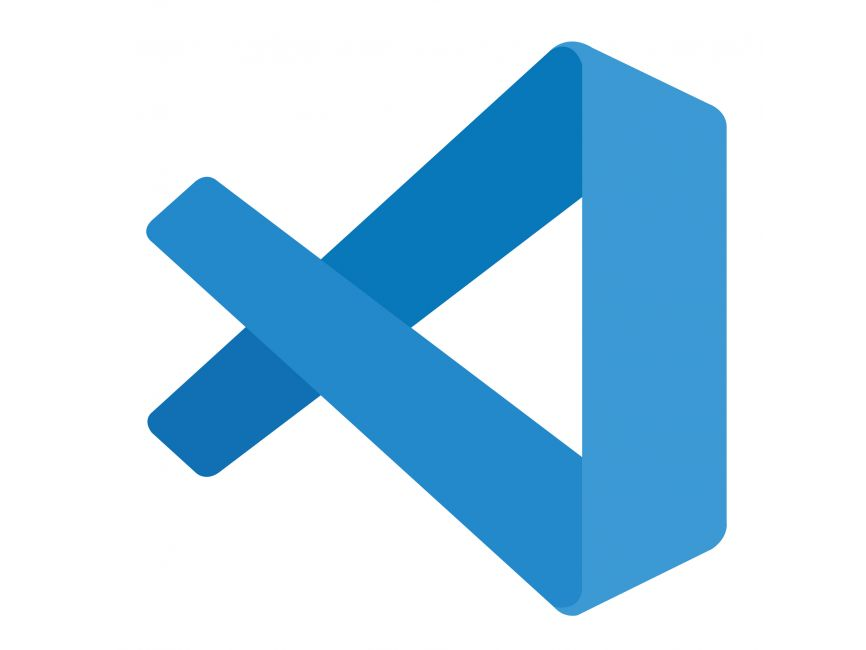

<!-- encabezados -->

# Como poner titulos

-se ponen # desde 1 hasta 6 #titulo

## subtitulo == ##text

### italika, string, tachado

<!-- italika -->
this is an *italic* text con un * al inicio y al final
<!-- string -->
this is an **strong** text con 2 ** al inicio y al final
<!-- strikethrought -->
this is an ~~tachado~~ text con 2 signos ~~ al inicio y al final


<!-- ul lista con vinetas -->

### -lista con puntos con el signo -

- apple
    - apple 2
        - apple 3
- orange
- etc

<!-- lista ordenada con numeros -->
### -lista ordenada con numeros

1. apple 


### -Links
[www.google.com](https://www.google.com)

*el texto de el link se pone entre corchetes y el link se pone entre parentesis*


### citas 
* se pone conel signo >
> esto es una cita

## separadores similares a HR

* se ponen con tres veces el signo --- 

---

## pegar codigo 
* para esto se usan las comillas `` todo el codigo se pone dentro de estas lineas y se 

`console.log(variable)`
* y asi se veria el codigo

## pegar codigo en bloque

* se usan las triples tildes al inicio y al final, en total 6 al inicio de las primeras 3 comillas puuedes poner que lenguaje de codigo es y te colorea las lineas de codigo

```javascript
    aqui iria todo el codigo a pegar
```

## generar tablas 
* se separa con el pipe | y con el --- 

| tables | are | cool |
|--------|-----|------|
|col 3 is| right aligned | 1600
|col 3 is| right aligned | 1600
|col 3 is| right aligned | 1600


## generar imagenes 

* aqui se llaman las url o ubicacion se pone entre corchetes el texto que se puede ver y entre parentesis el link, a diferencia del link normal a este se le pone un signo de exclamacion al inicio 



# MARKDOWNS DE GITHUB
##### estos son markdowns especiales de github para la documentacion de tus proyectos

## hacer un to do list


* [x] task 1